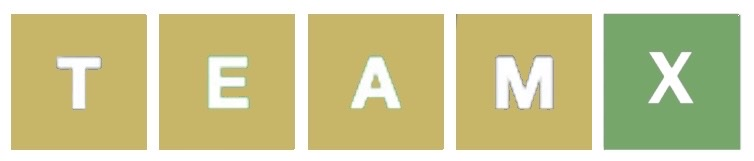
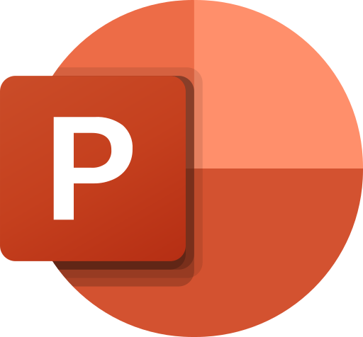

# Team "X"

  
## Table of contents
* [Project description](#description) 
* [Team members](#teamMembers) 
* [Technologies used](#technologies)
  

## Project description <a name="description">
A game where you get three, five or eight attempts (depending on the mode you choose) to guess a five-letter word.
  

## Team members 
1. [Roberta Hristova](https://github.com/RFHristova23) as Front-End Developer
2. [Leya Susova](https://github.com/LESusova23) as Back-End Developer
3. [Nia Georgieva](https://github.com/NGGeorgieva23) as Designer
4. [Ekaterina Zalinskaya](https://github.com/EDZalinskaya23) as Scrum Trainer
  

## Technologies used 
### Writing code & commiting
) 

### Apps used for documentation, presentation & communication:

